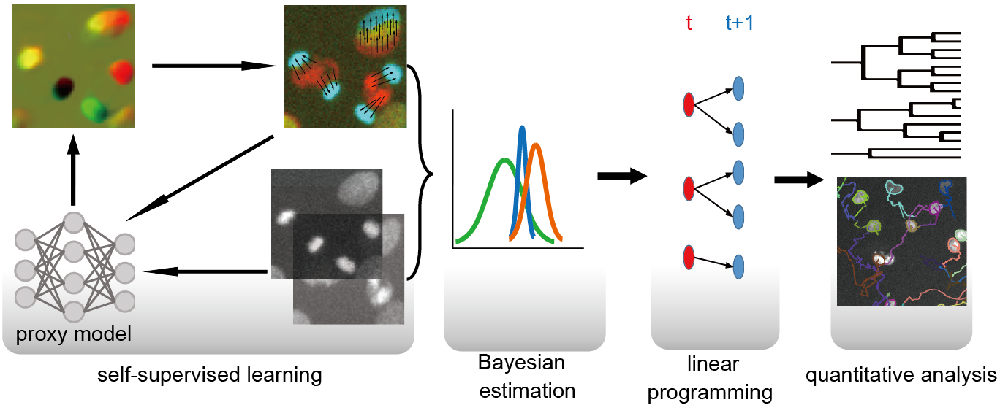
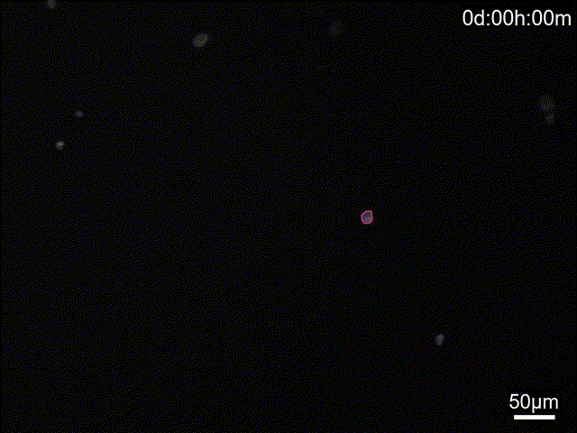

# Learning–Estimation–Decision LED
*A Self-Supervised Learning–Estimation–Decision Framework for Robust Cell Tracking*


---

## 📌 Introduction

a novel **Self-Supervised Learning–Estimation–Decision (LED)** framework for robust cell tracking in time-lapse microscopy sequences.  



The framework integrates:

- **Learning**: self-supervised representation learning to represent cell movement and division pattens  
- **Estimation**: posterior linking probability based on Bayesian theorem
- **Decision**: global optimization to resolve cell associations, divisions, and disappearances  

These designs enable stable tracking for unseen data under vary imaging conditions, dense cell populations, and vary cell types.



---

## 🧰 Dependencies
### 0. Clone the Repository:
```bash
git clone https://github.com/MingweiMin-Lab/LED.git
```
enter the directory
```bash
cd LED
```
**Note:** The code was tested on Windows/Linux with NVIDIA GPUs but not Mac.
### 1. Conda Environment (Recommended for Windows + NVIDIA GPU)
Create your environment:
```bash
conda create -n your_env_name python=3.11
```
and then activate it:
```bash
conda activate your_env_name
```
### 2. PyTorch Installation (Deep Learning & Large-Scale Image Processing)
Ensure you have a compatible NVIDIA driver. 
```bash
pip3 install torch torchvision --index-url https://download.pytorch.org/whl/cu126
```
### 3. Pip Packages
```bash
pip install -r requirements.txt
```
---

## 📁 Data Preparation

Place your data in the following structure:

```text
data/
├── img/        # Time-lapse cell images (*.tif)
│   ├── frame_0001.tif
│   ├── frame_0002.tif
│   └── ...
├── mask/       # Cell segmentation masks (same resolution as images, *.tif)
│   ├── mask_0001.tif
│   ├── mask_0002.tif
│   └── ...
```

✅ Each image must have a corresponding segmentation mask (with sorted name).

---

## ⚙️ Key Parameters

Important tracking-related parameters are defined in the configuration file (`config/tracker.yaml`).

### Core parameters

| Parameter | Description                                         |
|----------|-----------------------------------------------------|
| `max_movemment` | Maximum allowed **pixel** distance for cell linking |

### Optional parameters

| Parameter | Description |
|----------|-------------|
| `division_detect` | whether to pre-detect division for subsequent self-supervised training |
| `run_num` | number of parallel processes |
| `division` |whether to use division constraints in LP|
| `jitter_thr` | threshold for jitter correction |
| `post_pro` | post process including pruning and merging tracks|
|...|...|

---

## ▶️ Usage Example
**Note:** verify your data and configurations (`config/tracker.yaml`).
### run main.py `python main.py` or the simple code below 
```
from train import train_model as tm
from predictor import predictor as pr
from cell_tracking import tracker as ct

tm()
pr()
ct()
```
### or use jupyter
Launch jupyter notebook and run demo.ipynb
```bash
jupyter notebook
```

---

## 📊 Output

After execution, results will be saved as:

```text
results/
├── track.csv                           # Cell trajectory matrix: frame × cell
├── CTC format result                   # Cell Tracking Challenge format 
└── visualization of lineage tree       # Lineage tree
```

---

